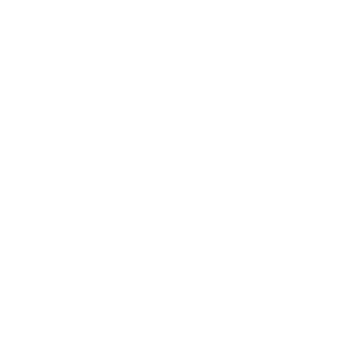

### 
Hi there👋

I'm a fullstack developer 👨‍💻 interested in:

- 🦀 Rust

- 🚀 DevOps (Docker, k8s)

- 🌐 Web Components & Microfrontends

- ₿ Bitcoin & Decentralized Protocols

🚀 Currently working with Docker tooling to make complex deployments accessible. Since many don't use k8s, I adapt existing solutions and write Rust utilities to simplify interactions.

🦀 Building everything possible in Rust - from deployment automation tools to OIDC and SSL integration utilities for Docker configs.

🌐 Exploring microfrontends and web components with lit.js, while keeping backend development in Rust.

🌱 Interested in decentralized protocols: Bitcoin layers, Nostr, Matrix, Radicle and other p2p solutions, preferably implemented in Rust.

 

 

## Github Stats

<picture>
  <source
    srcset="https://github-readme-stats.vercel.app/api/top-langs/?username=zyrakq&theme=dark"
    media="(prefers-color-scheme: dark)"
  />
  <source
    srcset="https://github-readme-stats.vercel.app/api/top-langs/?username=zyrakq"
    media="(prefers-color-scheme: light), (prefers-color-scheme: no-preference)"
  />

</picture>
<picture>
  <source
    srcset="https://github-readme-stats.vercel.app/api?username=zyrakq&show_icons=true&theme=dark"
    media="(prefers-color-scheme: dark)"
  />
  <source
    srcset="https://github-readme-stats.vercel.app/api?username=zyrakq&show_icons=true"
    media="(prefers-color-scheme: light), (prefers-color-scheme: no-preference)"
  />
  
</picture>

 

 My Skill Set 
<table><tr><td valign="top" width="33%">

### Frontend

</td><td valign="top" width="33%">

### Backend

</td><td valign="top" width="33%">

### DevOps

</td></tr></table>

 

### Support Me

